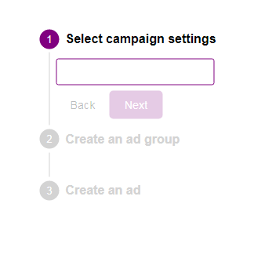

# Verical Stepper Vanilla JS

## What is it?

A basic replication of Material-UI's [vertical stepper](https://material-ui.com/components/steppers/#vertical-stepper), but in pure JS classes as an exercise.

## How to run it?

This runs with parcel with the command _npm start_.

